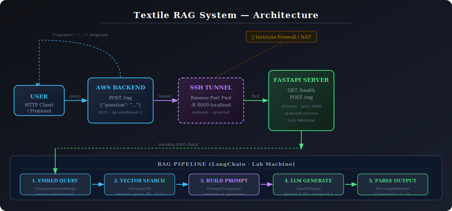

# Textile RAG API

A domain-specific Retrieval-Augmented Generation (RAG) system for the textile industry, exposed as a REST API via FastAPI. The model runs locally on a lab machine and is accessible to cloud backends through a reverse SSH tunnel.

---

## Graphical Abstract



---

## Overview

This system answers textile-domain questions by retrieving relevant context from a ChromaDB vector store and generating answers using a local LLM (Ollama). It is designed to run on a GPU lab machine behind an institute firewall and be called remotely from an AWS backend via a reverse SSH tunnel.

---

## Project Structure

```
RAG/
├── main.py               # FastAPI app — entry point
├── retreiver.py          # ChromaDB vector store + OllamaEmbeddings
├── llm.py                # ChatOllama LLM setup
├── prompts.py            # Prompt template
├── ragas_evaluation.py   # Evaluation pipeline (RAGAS + GPT-4o)
└── requirements.txt      # Python dependencies
```

---

## API Reference

Base URL (from AWS EC2 via tunnel): `http://localhost:8000`

### `GET /health`

Health check — use this to verify the server and tunnel are alive.

**Response:**
```json
{"status": "ok"}
```

---

### `POST /rag`

Ask a question. Returns an answer grounded in the textile knowledge base.

**Request body:**
```json
{
  "question": "What is the scope of textile engineering?"
}
```

**Response:**
```json
{
  "question": "What is the scope of textile engineering?",
  "answer": "Textile engineering covers fabric production, clothing manufacturing..."
}
```

**Error response (500):**
```json
{
  "detail": "error message here"
}
```

---

## RAG Pipeline

Each request goes through this chain:

```
Question
   ↓
OllamaEmbeddings (nomic-embed-text)   — embed the query
   ↓
ChromaDB similarity search (k=2)      — retrieve top 2 relevant chunks
   ↓
PromptTemplate                         — build context + question prompt
   ↓
ChatOllama (qwen2.5:7b, temp=0.3)     — generate answer
   ↓
StrOutputParser                        — return plain text answer
```

The pipeline is loaded **once at startup** — not on every request — for performance.

---

## Setup & Running

### Prerequisites

- Python 3.10+
- [Ollama](https://ollama.com) running locally with these models pulled:
  ```bash
  ollama pull qwen2.5:7b
  ollama pull nomic-embed-text
  ```
- ChromaDB vector store at `./chroma_qwen_db` (pre-built from textile corpus)

### Install dependencies

```bash
pip install fastapi uvicorn langchain langchain-community langchain-ollama chromadb
```

### Run the server

```bash
cd /path/to/RAG
uvicorn main:app --host 0.0.0.0 --port 8000
```

### Test locally

```bash
curl http://localhost:8000/health

curl -X POST http://localhost:8000/rag \
  -H "Content-Type: application/json" \
  -d '{"question": "tell me about scope of textile"}'
```

---

## Infrastructure — Reverse SSH Tunnel

The lab machine is behind an institute NAT/firewall with no public IP. A reverse SSH tunnel makes it accessible to the AWS backend without any firewall changes.

### How it works

```
Lab Machine                          AWS EC2
FastAPI :8000  ←──SSH Tunnel──────→  localhost:8000
(private)           (outbound)        (public)
```

The lab machine initiates an outbound SSH connection to EC2 and instructs it to forward traffic from its port 8000 back through the tunnel to the lab machine's port 8000. The AWS backend simply calls `http://localhost:8000` on EC2.

### Persistent services (systemd)

Both FastAPI and the tunnel run as systemd services — they start automatically on boot and restart if they crash.

**Check status:**
```bash
sudo systemctl status rag-api       # FastAPI server
sudo systemctl status rag-tunnel    # SSH tunnel
```

**Restart if needed:**
```bash
sudo systemctl restart rag-api
sudo systemctl restart rag-tunnel
```

**View logs:**
```bash
sudo journalctl -u rag-api -f
sudo journalctl -u rag-tunnel -f
```

---

## Evaluation (RAGAS)

`ragas_evaluation.py` runs a full automated evaluation of the RAG pipeline.

### What it does

1. Samples N random chunks from ChromaDB
2. Generates question + ground truth pairs using GPT-4o Mini
3. Runs each question through the RAG chain
4. Evaluates with RAGAS using GPT-4o as judge

### Metrics

| Metric | What it measures |
|---|---|
| Faithfulness | Is the answer grounded in the retrieved context? |
| Answer Relevancy | Does the answer actually address the question? |
| Context Recall | Did retrieval find all necessary information? |
| Context Precision | Is the retrieved context relevant (no noise)? |

### Setup

```bash
pip install -r requirements.txt
```

Create a `.env` file:
```
OPENAI_API_KEY=your_key_here
```

### Run evaluation

```bash
python ragas_evaluation.py
```

Results are saved to `ragas_results.csv`. Aggregate scores are printed to console.

### Configuration

Edit the config block at the top of `ragas_evaluation.py`:

```python
NUM_QUESTIONS    = 30          # number of test questions
GENERATION_MODEL = "gpt-4o-mini"   # for generating ground truth
JUDGE_MODEL      = "gpt-4o"        # for RAGAS evaluation
RESULTS_PATH     = "ragas_results.csv"
```

---

## For Frontend Engineers

The API accepts and returns JSON. Here is a minimal fetch example:

```javascript
const response = await fetch("http://YOUR_EC2_IP/rag", {
  method: "POST",
  headers: { "Content-Type": "application/json" },
  body: JSON.stringify({ question: "What is warp yarn?" })
});

const data = await response.json();
console.log(data.answer);
```

The `/health` endpoint can be polled to check if the server is available before sending queries.

---

## For Backend Engineers

- The RAG server listens on `http://localhost:8000` on the EC2 instance (via tunnel)
- No authentication is currently implemented — add API key middleware if exposing publicly
- The server is single-threaded (Ollama runs one inference at a time) — queue requests if needed
- Average response time: 1–5 seconds depending on question complexity
- The tunnel is managed by `autossh` + `systemd` on the lab machine — it self-heals on disconnection

---

## Tech Stack

| Component | Technology |
|---|---|
| API framework | FastAPI + Uvicorn |
| LLM | Ollama — qwen2.5:7b |
| Embeddings | Ollama — nomic-embed-text |
| Vector store | ChromaDB |
| RAG framework | LangChain |
| Evaluation | RAGAS + GPT-4o |
| Tunnel | autossh + systemd |
| Cloud | AWS EC2 (Ubuntu 24.04) |
