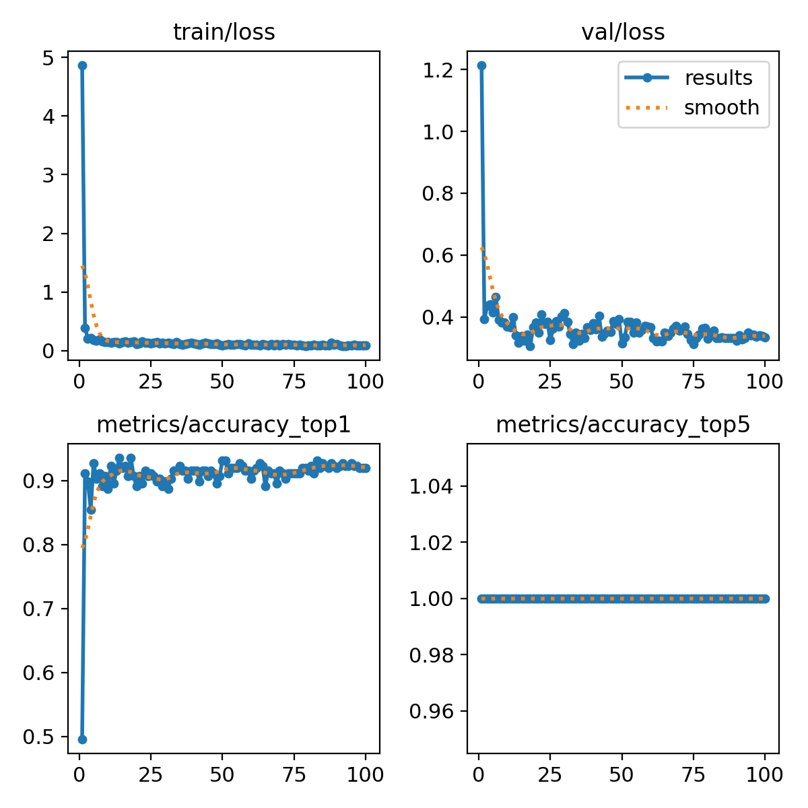
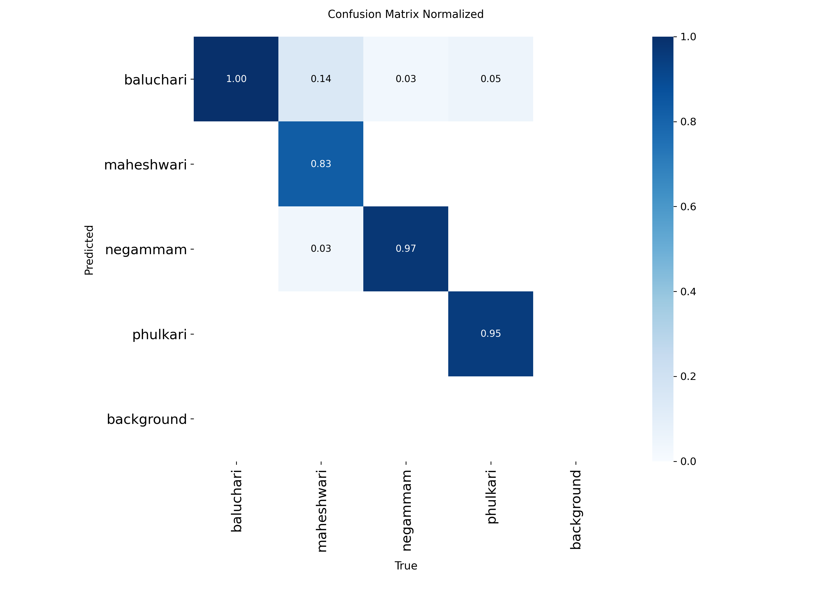
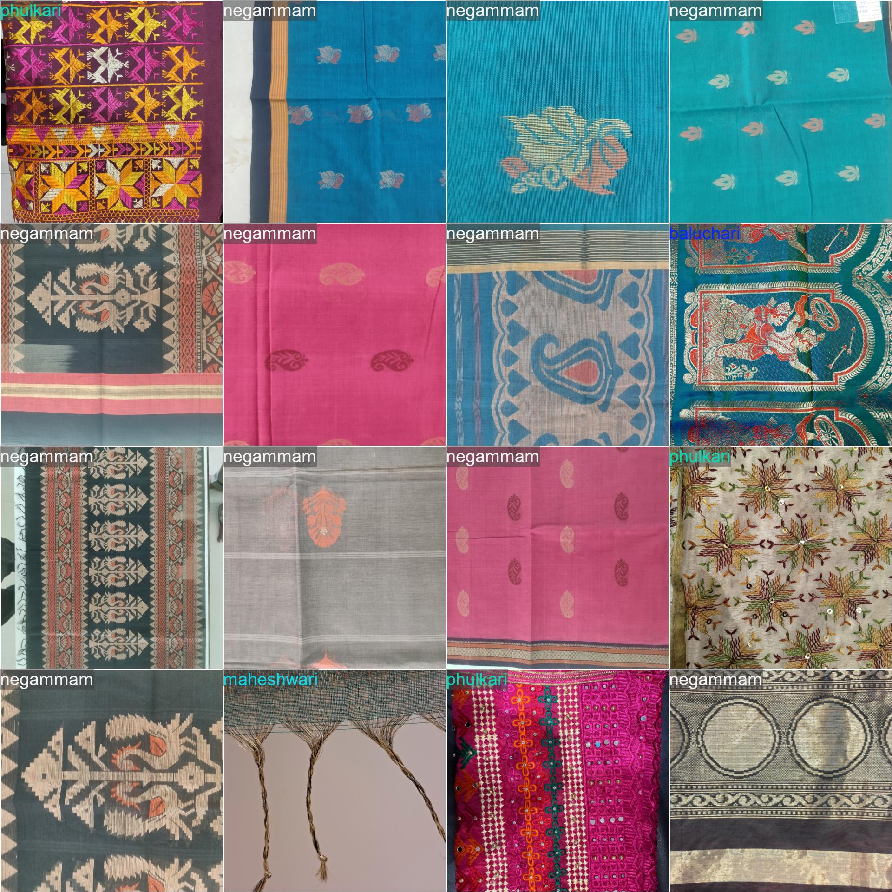

# YOLO11m 4-Class Textile Classifier Report

This document outlines the training and evaluation metrics for the updated YOLO11m classification model, trained on the 4-class textile dataset.

## 1. Model and Training Configuration

The model was trained utilizing transfer learning from the baseline weight `YOLO11m_benchmark/weights/best.pt`. The following configurations were applied during the process:

- **Model Architecture:** YOLO11m (Image Classification)
- **Task:** Classify
- **Total Classes:** 4 
- **Input Image Size:** 640x640 pixels
- **Training Epochs:** 100
- **Batch Size:** 32
- **Optimizer:** Automatic selection
- **Patience:** 100 epochs (Early stopping was not triggered)
- **Data Augmentation:** Standard augmentations were disabled; utilized automatic augmentation (`randaugment`) with random erasing set to 0.4.

## 2. Training Performance Results

The training phase was executed for 100 epochs over the designated dataset. Convergence was properly established without critical signs of overfitting. 

### 2.1 Key Metrics
- **Best Validation Accuracy (Top-1):** 0.93548 (recorded at Epochs 14 and 18)
- **Final Validation Accuracy (Top-1):** 0.91935 (at Epoch 100)
- **Final Training Loss:** 0.09135
- **Final Validation Loss:** 0.33362

The loss trend demonstrated a rapid initial learning phase, stabilizing after the 10th epoch. The validation top-1 accuracy remained consistently in the ~91% to 93% range, indicating a robust internal representation of the 4 classes.

## 3. Visualizations

The following sections contain the epoch-by-epoch loss reduction, accuracy progressions, and confusion matrix data pinpointing classification distributions.

### 3.1 Epoch Performance Metrics
Below is the graphical representation of the training and validation loss, along with Top-1 and Top-5 accuracy progression over the 100 epochs.

### 3.2 Normalized Confusion Matrix
The normalized confusion matrix provides the proportion of accurate classifications versus misclassifications across the 4 textile classes.

### 3.3 Validation Predictions Sample
The image below displays a sample batch of validations containing the model predictions versus ground truth labels.

## 4. Conclusion

The transfer learning adaptation of the YOLO11m model for the 4-class textile dataset achieved strong performance. The peak top-1 accuracy reached approximately 93.5%. With stable validation loss behavior during the final training stages, the resulting weights located at `weights/best.pt` provide a highly reliable baseline for the classification application.
